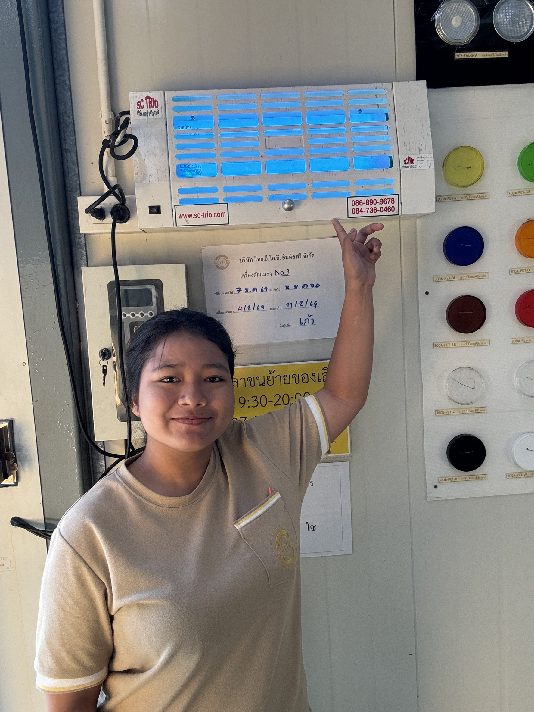

**[<< ย้อนกลับ](https://aroonphattt-03.github.io)

# เครื่องดักจับแมลง (หลอดไฟล่อแมลง UV)> 
 

<h2 style="color: green;">
  
  PDCA คืออะไร?

</h2> 

<ul style="color: white; font-size:18px;">
  
PDCA คือ วงจรการบริหารงานเพื่อการปรับปรุงอย่างต่อเนื่อง ประกอบด้วย 4 ขั้นตอน ได้แก่

P = Plan (วางแผน)
D = Do (ปฏิบัติ)
C = Check (ตรวจสอบ)
A = Act (ปรับปรุงแก้ไข)

> อธิบายตามรูป (ตัวอย่างการควบคุมเครื่องดักแมลง)
🟢 1. Plan (วางแผน)

วางแผนติดตั้งเครื่องดักแมลงในจุดเสี่ยง

กำหนดรอบตรวจเช็ค เช่น ตรวจทุกวัน / เปลี่ยนหลอดทุก 6 เดือน

กำหนดผู้รับผิดชอบ (เช่น เจ้าหน้าที่ในภาพ)

> 👉 ในรูปมีป้ายกำหนดวันตรวจสอบ แสดงถึงการวางแผนล่วงหน้า

🔵 2. Do (ปฏิบัติ)

เปิดใช้งานเครื่อง

ทำความสะอาดแผ่นกาว

เปลี่ยนหลอดไฟตามกำหนด

บันทึกข้อมูลการตรวจ

> 👉 บุคคลในภาพกำลังชี้ที่เครื่อง แสดงถึงการปฏิบัติงานตรวจสอบ

🟡 3. Check (ตรวจสอบ)

ตรวจดูว่าไฟติดปกติหรือไม่

มีแมลงติดมากผิดปกติหรือไม่

เครื่องทำงานเต็มประสิทธิภาพหรือไม่

ตรวจสอบวันที่บันทึกว่าตรงตามแผนหรือไม่

> 👉 ในภาพเห็นเอกสารกำกับวันตรวจ แสดงขั้นตอนการ Check
🔴 4. Act (ปรับปรุงแก้ไข)

ถ้าไฟไม่ติด → เปลี่ยนหลอด

ถ้าแมลงเยอะผิดปกติ → เพิ่มจุดติดตั้ง

ถ้าพบปัญหาบ่อย → ปรับแผนบำรุงรักษา

คือการนำผลตรวจมาปรับปรุงให้ดีขึ้น

> ✨ สรุปตามภาพ

ภาพนี้เป็นตัวอย่างของการนำ PDCA มาใช้ในการควบคุมคุณภาพและสุขลักษณะในสถานที่ทำงาน เพื่อให้เครื่องดักแมลงทำงานได้อย่างมีประสิทธิภาพและปลอดภัย
