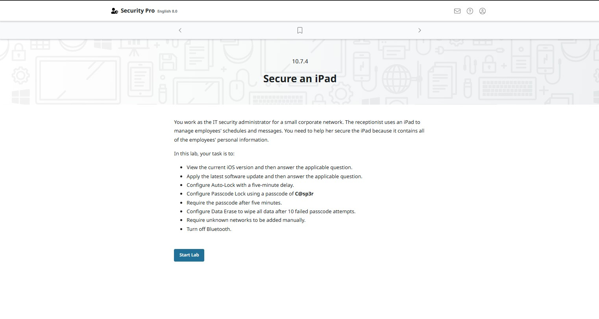
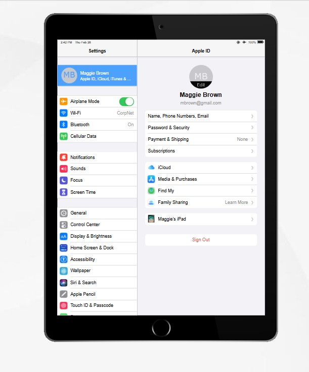
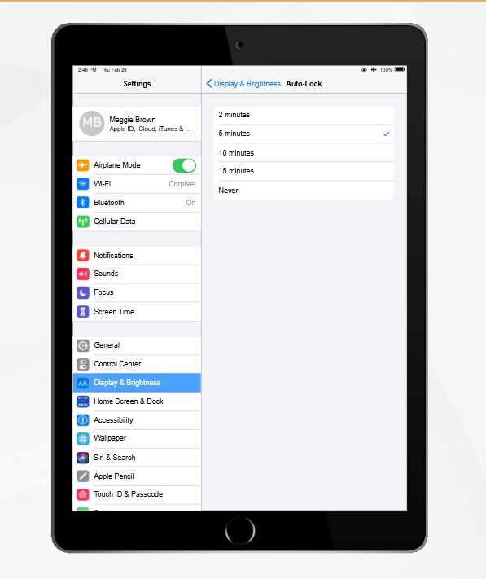
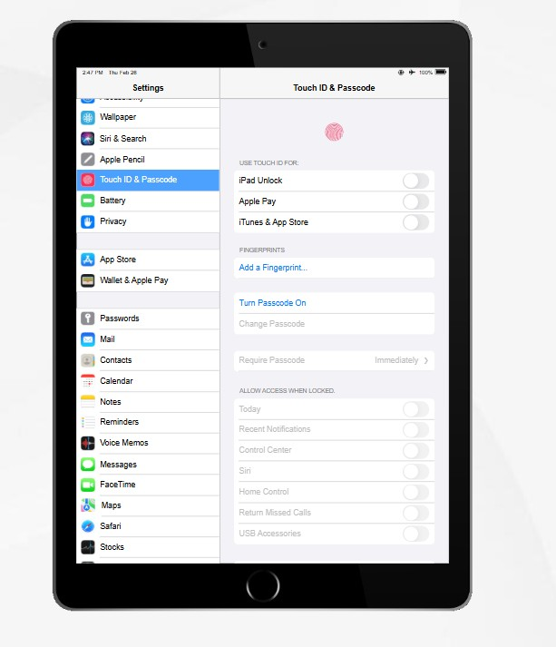
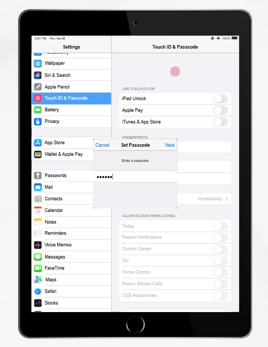
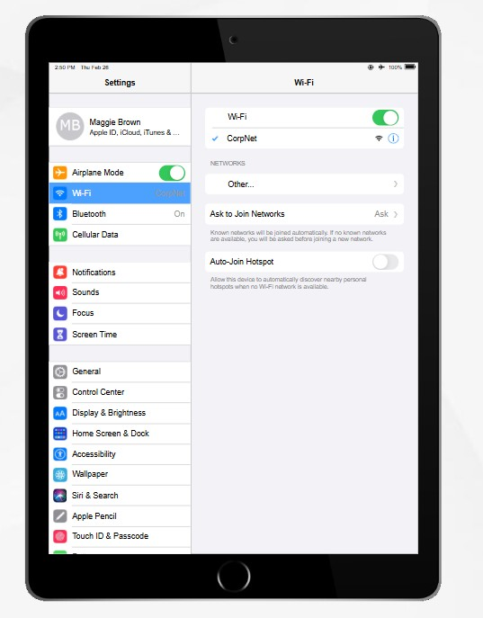
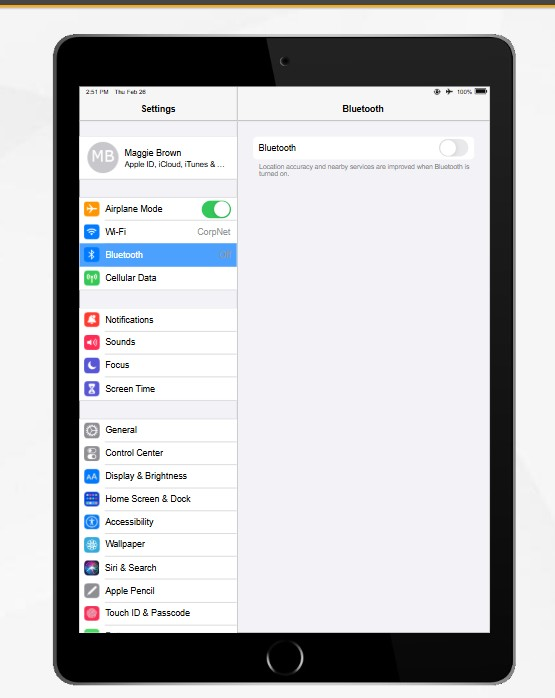
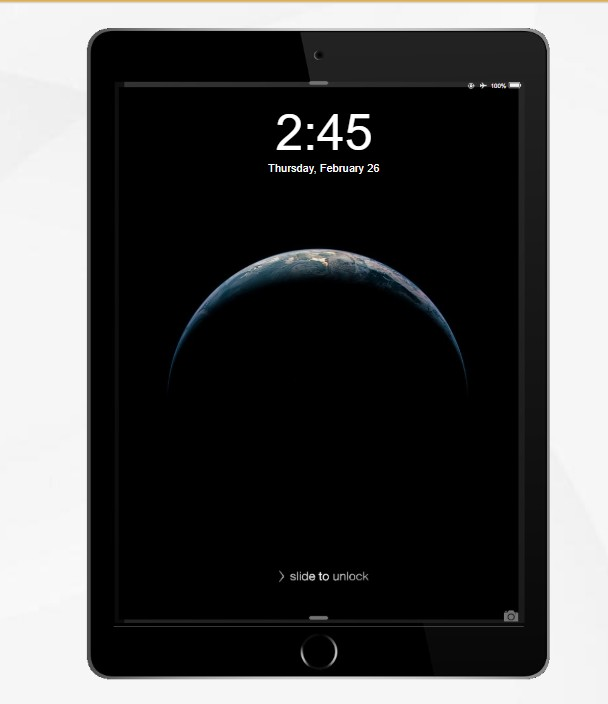

**[<< ย้อนกลับ](https://aroonphattt-03.github.io)

# 10.7.4 Secure an iPad

## ขั้นตอนการทำ : จากภาพเป็น Lab เรื่อง Secure an iPad (10.7.4) ให้ตั้งค่าความปลอดภัย iPad ตามเงื่อนไขที่กำหนด
 ขั้นตอนการทำแบบละเอียดทีละข้อ 👇

✅ 1) ตรวจสอบเวอร์ชัน iOS ปัจจุบัน
เข้า Settings (การตั้งค่า) ไปที่ General (ทั่วไป)
กด About (เกี่ยวกับ) ดูที่ iOS Version / iPadOS Version
ตอบคำถามใน Lab ตามเวอร์ชันที่เห็น

----

✅ 2) อัปเดตเป็นเวอร์ชันล่าสุด
ไปที่ Settings เลือก General
กด Software Update
กด Download and Install
รอจนติดตั้งเสร็จ ตอบคำถามใน Lab

----

✅ 3) ตั้งค่า Auto-Lock เป็น 5 นาที
ไปที่ Settings เลือก Display & Brightness
กด Auto-Lock เลือก 5 Minutes

----

✅ 4) ตั้งค่า Passcode เป็น C@sp3r
ไปที่ Settings เลือก Face ID & Passcode หรือ Touch ID & Passcode
กด Turn Passcode On เลือก Passcode Options
เลือก Custom Alphanumeric Code
ใส่รหัส : C@sp3r ยืนยันรหัสอีกครั้ง

----

✅ 5) ตั้งค่า Require Passcode หลัง 5 นาที
ยังอยู่ในหน้า Passcode settings หาเมนู Require Passcode
เลือก After 5 Minutes

----

✅ 6) ตั้งค่าให้ลบข้อมูลเมื่อใส่รหัสผิด 10 ครั้ง
เลื่อนลงด้านล่างในหน้า Passcode เปิดสวิตช์ Erase Data
(ลบข้อมูลอัตโนมัติเมื่อใส่รหัสผิด 10 ครั้ง)

----

✅ 7) ตั้งค่าให้เพิ่ม Wi-Fi ที่ไม่รู้จักเองเท่านั้น
ไปที่ Settings เลือก Wi-Fi ปิด Auto-Join Hotspot (ถ้ามี)
ปิดการเชื่อมต่ออัตโนมัติ → ให้เลือกเครือข่ายและใส่รหัสเองเท่านั้น

----

✅ 8) ปิด Bluetooth
ไปที่ Settings เลือก Bluetooth
ปิดสวิตช์ให้เป็น Off

----

🎯 สรุปสิ่งที่ต้องได้
✔ อัปเดต iOS ล่าสุด
✔ Auto-Lock = 5 นาที
✔ Passcode = C@sp3r
✔ Require Passcode = 5 นาที
✔ Erase Data = เปิด
✔ เพิ่ม Wi-Fi เอง
✔ Bluetooth = ปิด

----

👉 Settings > General > About
และเห็นว่า
📱 Software Version = 15.2
👉 ถ้า Lab ให้ “อัปเดตเวอร์ชันล่าสุด”
ให้กดตามนี้ : กด < General (มุมซ้ายบน)
แล้วกด Software Update
กด Download and Install
รอให้อัปเดตเสร็จ

----

🎯 สรุปสั้น ๆ
ตอนนี้หน้านี้ยังไม่ต้องกดอะไรเพิ่ม
ให้กด General (ย้อนกลับ) → แล้วเข้า Software Update

