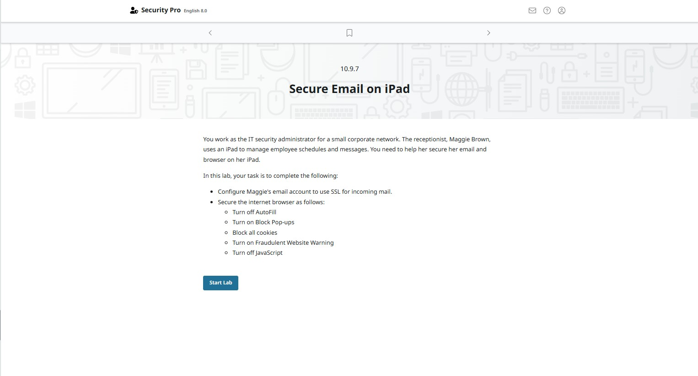
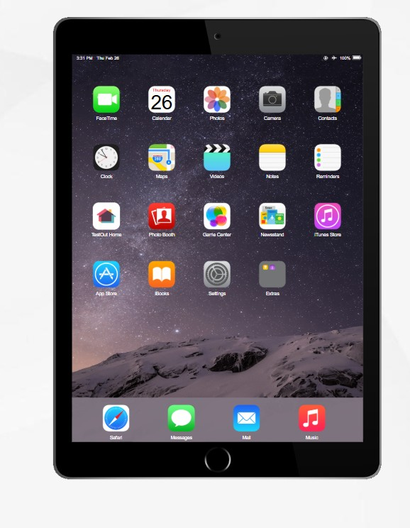
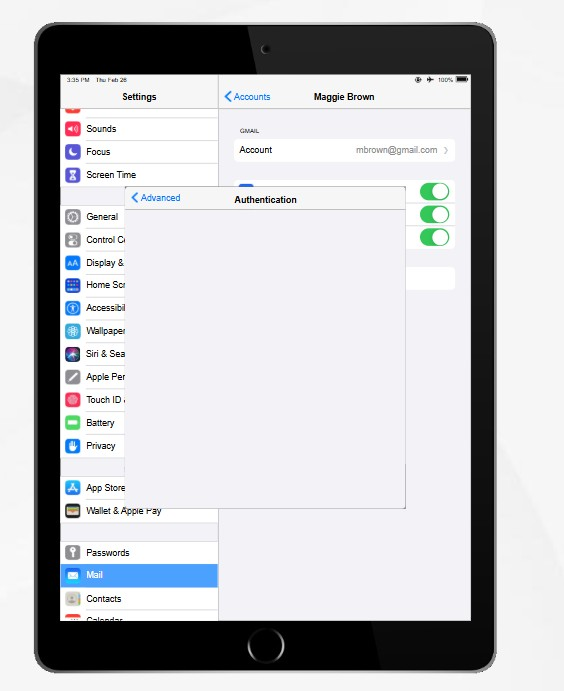
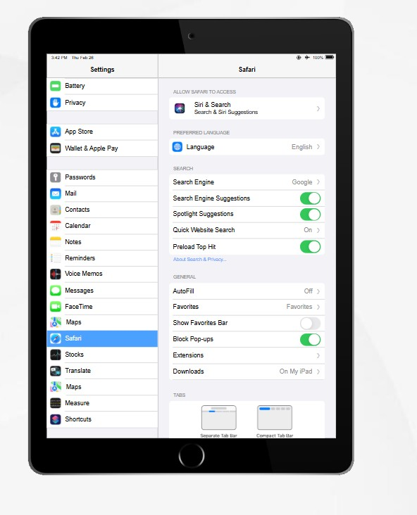
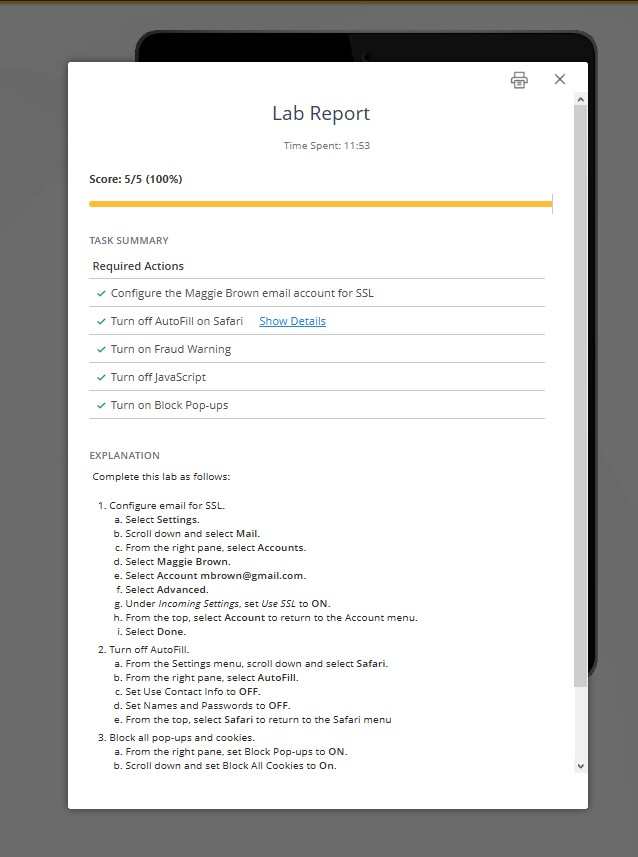
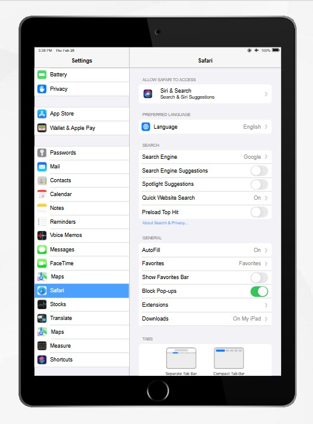
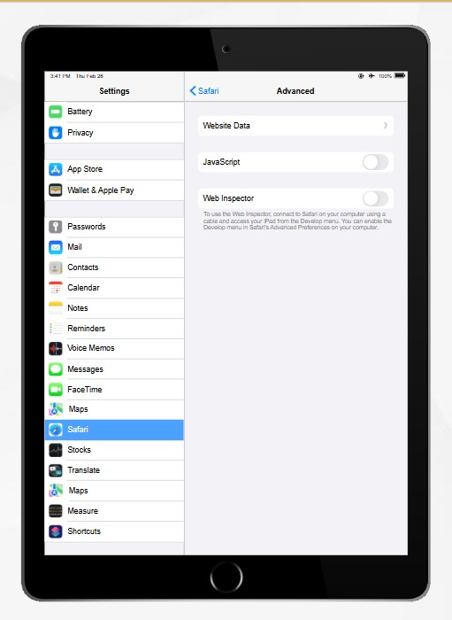
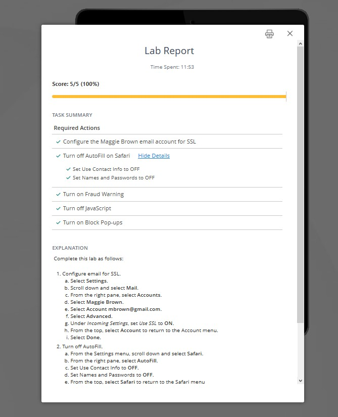

**[<< ย้อนกลับ](https://aroonphattt-03.github.io)

# 10.9.7 Secure Email on iPad 

จากภาพเป็น Lab Secure Email on iPad ให้ตั้งค่าอีเมลให้ใช้ SSL และปรับความปลอดภัยของ Safari ตามเงื่อนไขด้านล่าง ทำตามขั้นตอนนี้ได้เลย 👇

🔐 ส่วนที่ 1: ตั้งค่า Email ให้ใช้ SSL (Incoming Mail)
ที่หน้า Home กด Settings เลือก Mail, Contacts, Calendars (หรือ Mail)
เลือกบัญชีอีเมลของ Maggie กด Account
กด Advanced เปิด (ON) ตัวเลือก Use SSL
ตรวจสอบว่า Authentication ถูกต้อง (เช่น Password) กด Done เพื่อบันทึก
✅ เสร็จขั้นตอนการตั้งค่า SSL สำหรับ Incoming Mail

---

🌐 ส่วนที่ 2: ตั้งค่าความปลอดภัย Safari
กลับไปหน้า Settings แล้วเลือก Safari
ทำตามนี้ทีละข้อ : ❌ Turn off AutoFill
กด AutoFill ปิด (OFF) ทุกตัวเลือก

---

✅ Turn on Block Pop-upsเปิด (ON) Block Pop-ups

---

🚫 Block all cookiesกด Block Cookies เลือก Always Block

---

⚠️ Turn on Fraudulent Website Warning
เปิด (ON) Fraudulent Website Warning

---

❌ Turn off JavaScript
เลื่อนลง กด Advanced ปิด (OFF) JavaScript

---

🎯 สรุปค่าที่ต้องได้ Use SSL = ON
AutoFill = OFF
Block Pop-ups = ON
Block Cookies = Always Block
JavaScript = OFF

---

🏆 ผลลัพธ์สุดท้ายของ Lab
✔ ระบบ Email ปลอดภัยด้วย SSL
✔ Safari ถูก Harden ตามเงื่อนไข
✔ ผ่านเงื่อนไข Lab 10.9.7 ครบ 100%
Fraudulent Website Warning = ON

