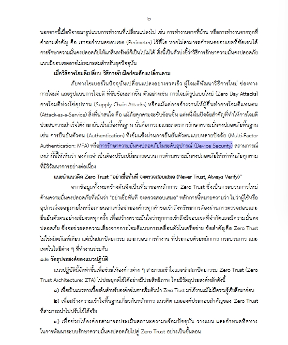

**[⬅️ ย้อนกลับ](https://aroonphattt-03.github.io)

# 🔐การรักษาความมั่นคงปลอดภัยในระดับอุปกรณ์ (Device Security)

<h2 style="color: green;">
    คือ การป้องกันและควบคุมความปลอดภัยของอุปกรณ์ที่ใช้เชื่อมต่อกับระบบเครือข่ายหรือข้อมูลขององค์กร เช่น คอมพิวเตอร์ โน้ตบุ๊ก มือถือ แท็บเล็ต หรืออุปกรณ์ IoT เพื่อป้องกันการถูกโจมตี การติดมัลแวร์ หรือการเข้าถึงข้อมูลโดยไม่ได้รับอนุญาต
ในแนวคิด Zero Trust จะไม่เชื่อถืออุปกรณ์ใด ๆ โดยอัตโนมัติ แม้จะอยู่ในเครือข่ายองค์กรก็ตาม ต้องมีการตรวจสอบก่อนทุก
</h2>

 

# วัตถุไวไฟ 🔥⚠️
