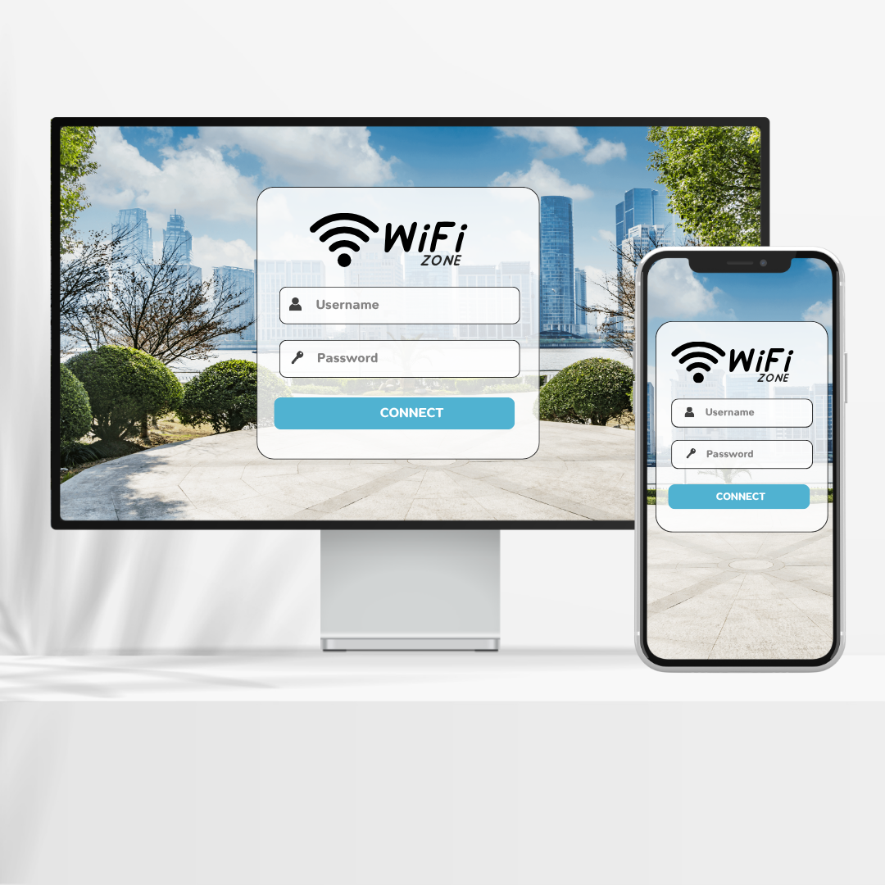
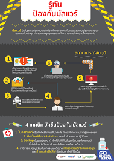

**[⬅️ ย้อนกลับ](https://aroonphattt-03.github.io)

# 🔐คำที่เกี่ยวข้องกับ "ชีวิตประจำวัน" การรักษาความมั่นคงปลอดภัยในระดับอุปกรณ์ (Device Security) 

<h3 style="color: white;">
         คือ การป้องกันและควบคุมความปลอดภัยของอุปกรณ์ที่ใช้เชื่อมต่อกับระบบเครือข่ายหรือข้อมูลขององค์กร เช่น คอมพิวเตอร์ โน้ตบุ๊ก มือถือ แท็บเล็ต หรืออุปกรณ์ IoT เพื่อป้องกันการถูกโจมตี การติดมัลแวร์ หรือการเข้าถึงข้อมูลโดยไม่ได้รับอนุญาต
ในแนวคิด Zero Trust จะไม่เชื่อถืออุปกรณ์ใด ๆ โดยอัตโนมัติ แม้จะอยู่ในเครือข่ายองค์กรก็ตาม ต้องมีการตรวจสอบก่อนทุก
</h3>

 

# 🔐 อธิบายหลักการสำคัญของ Device Security

<h5 style="color: black;">
         ตรวจสอบตัวตนอุปกรณ์ (Device Authentication)
ระบบต้องรู้ว่าอุปกรณ์นั้นเป็นของใคร และได้รับอนุญาตหรือไม่

    ตรวจสอบสถานะความปลอดภัยของอุปกรณ์ (Device Health Check)
เช่น มีการอัปเดตระบบหรือไม่ มีแอนติไวรัสหรือไม่ เครื่องถูกเจลเบรกหรือรูทหรือไม่

    เข้ารหัสข้อมูล (Encryption)
ป้องกันข้อมูลรั่วไหลแม้อุปกรณ์สูญหาย

    ควบคุมสิทธิ์การเข้าถึง (Access Control)
อุปกรณ์ที่ไม่ปลอดภัยอาจถูกจำกัดสิทธิ์ หรือห้ามเข้าระบบ
</h5>

# 📌 ตัวอย่างการใช้งานจริง

 

<h5 style="color:white;">
         ตัวอย่างที่ 1: บริษัทใช้ระบบทำงานออนไลน์

     พนักงานต้องเข้าใช้งานระบบจากโน้ตบุ๊ก

ระบบจะตรวจสอบว่าเครื่องติดตั้งโปรแกรมป้องกันไวรัสหรือไม่

     ระบบปฏิบัติการอัปเดตล่าสุดหรือไม่

หากไม่ผ่านเงื่อนไข → ไม่อนุญาตให้เข้าระบบ

</h5>

# 📌 ตัวอย่างการใช้งานจริง

 

<h5 style="color: white;">
        ตัวอย่างที่ 2: มือถือพนักงานเชื่อมต่อ Wi-Fi องค์กร

    องค์กรใช้ระบบ Mobile Device Management (MDM)

บังคับตั้งรหัสผ่านหน้าจอ
     
     บังคับเข้ารหัสข้อมูล
     
</h5>

# 📌 ตัวอย่างการใช้งานจริง

 

<h5 style="color: white;">
       ตัวอย่างที่ 3: การป้องกันมัลแวร์
     
     ติดตั้งโปรแกรม Endpoint Security เช่น

ตรวจจับไวรัส

     ป้องกัน Ransomware

แจ้งเตือนเมื่อมีพฤติกรรมผิดปกติ
     
</h5>

# 🎯 สรุปการรักษาความมั่นคงปลอดภัยในระดับอุปกรณ์ (Device Security)🔐

<h5 style="color: white;">
     
Device Security คือ การทำให้อุปกรณ์ทุกเครื่องที่เชื่อมต่อระบบมีความปลอดภัยก่อนอนุญาตให้ใช้งาน
เพราะถ้าอุปกรณ์ไม่ปลอดภัย ต่อให้ระบบเครือข่ายแข็งแรงแค่ไหน ก็อาจถูกโจมตีได้

</h5>
